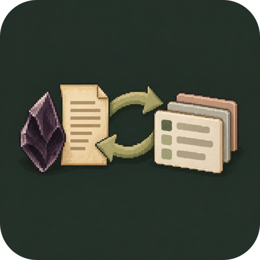

<h3>notion-sync</h3>

<p>
  <sub>OBSIDIAN OWNS THE NOTE, NOTION GETS A COPY</sub>
  <br>
  <strong>Opinionated two-way sync between opted-in Obsidian notes and one Notion data source.</strong>
  <br>
  <br>
  
  
  
  <a href="LICENSE"></a>
</p>

<br clear="left">

Obsidian always creates the relationship: no Notion page is imported unless a local note opted in and already holds its page ID. Mapping is deliberately limited, and anything it cannot represent stops the sync instead of silently losing content.

## Install

Download `main.js`, `manifest.json`, and `styles.css` from the latest [GitHub release](https://github.com/morris-frank/notion-sync/releases) into `<vault>/.obsidian/plugins/notion-sync/`, or add `morris-frank/notion-sync` in [BRAT](https://github.com/TfTHacker/obsidian42-brat). Then enable **Notion Sync** under Community plugins.

## Release

Bump `version` in `manifest.json` and `package.json`, add the version to `versions.json`, commit, then push a matching tag without a `v` prefix (`git tag 0.1.0 && git push origin 0.1.0`). CI checks the build and creates a draft GitHub release with the plugin files; publish it once reviewed.

## Install for development

```bash
mise run setup
```

This installs the locked Node/pnpm toolchain and dependencies, installs commit and pre-push hooks, and runs the complete repository gate. Later, use `mise run check`; focused tasks include `mise run lint`, `fmt`, `typecheck`, `test`, and `build`.

Copy or symlink this directory into `<vault>/.obsidian/plugins/notion-sync`, then enable **Notion Sync** under Community plugins. `pnpm run dev` watches and rebuilds `main.js`.

Create a Notion integration with read, insert, and update content capabilities. Share the database containing the data source with it. In the plugin settings, enter the integration token and the data source ID (not the database container ID).

## Start syncing a note

Add the configured boolean property (default `notion_sync`) to frontmatter:

```yaml
---
notion_sync: true
tags:
  - soil
status: Draft
date: 2026-07-19
---
```

Run **Notion Sync: Sync current note** or save the note. The plugin creates a page in the configured data source, then records:

```yaml
notion_page_id: …
notion_page_url: …
notion_last_synced_at: …
notion_local_hash: …
notion_remote_edited_at: …
```

During initial creation, `notion_sync_pending: true` may appear briefly. If content upload fails, the link is retained and the next sync safely retries that same page instead of creating a duplicate.

The returned `notion_page_id` is the identity from then on. Removing it creates a new Notion page on the next sync; do not remove it to relink a page. Setting `notion_sync: false` pauses both directions without deleting anything.

To permanently unlink the local note, run **Notion Sync: Remove Notion sync from current note**. This removes the configured opt-in property and all `notion_*` sync metadata written by the plugin. It leaves mapped user frontmatter such as `date`, `tags`, and `status` intact and does not delete or change the Notion page.

## Two-way behavior

- A local-only change pushes the note body and allowed frontmatter properties.
- A Notion-only change pulls supported page blocks and mapped properties into the same note.
- If both sides changed since the common snapshot, the side with the newest edit timestamp wins. The local timestamp is the file modification time; the remote timestamp is Notion's `last_edited_time`.
- The plugin polls opted-in notes at the configured interval. It also runs the same two-way decision after a local save and exposes manual current-note/all-note commands.
- Trashing or deleting does not propagate. A trashed linked page produces an error; restore it or turn off sync.
- Errors appear in the status bar. A failed note does not stop **Sync all** from checking the others.

This is timestamp conflict resolution, not a three-way text merge. Keep device clocks accurate. For sensitive notes, prefer manual sync by disabling polling and sync-after-save.

## Frontmatter/property mapping

The global comma-separated allowlist controls which frontmatter keys participate. Other frontmatter stays local. The JSON property-name map translates Obsidian keys to Notion column names:

```json
{
  "tags": "Tags",
  "status": "Status",
  "date": "Date"
}
```

Supported Notion property types are title (filename to the configured title column), rich text, number, checkbox, select, status, multi-select, date, URL, email, and phone number. Read-only and identity-shaped properties such as formula, rollup, people, relation, files, and timestamps are ignored. Values are converted according to the actual data-source schema. Property lookup is case-insensitive when unambiguous, so `tags` and `date` match conventional Notion properties named `Tags` and `Date`; explicit JSON mappings still win. An allowed frontmatter value with no compatible property now stops the sync with a concrete error instead of disappearing silently. Sync metadata never participates in the property filter.

The Obsidian filename is authoritative for the Notion title property. An ISO date prefix such as `2026-07-19 ` or `2026-07-19 — ` is deliberately omitted from the Notion title. A local rename is detected by manual sync or polling; changing only the Notion title is not treated as a request to rename the local file.

## Opinionated block mapping

| Obsidian Markdown                                | Notion block                                     |
| ------------------------------------------------ | ------------------------------------------------ |
| `#` through `###`                                | Heading 1 through 3                              |
| Paragraph                                        | Paragraph                                        |
| `-` / `*`                                        | Bulleted list item                               |
| `1.`                                             | Numbered list item                               |
| `- [ ]` / `- [x]`                                | To-do                                            |
| `> quote`                                        | Quote                                            |
| Fenced code                                      | Code                                             |
| `---`                                            | Divider                                          |
| `> [!type] Title`                                | Callout with a stable type-to-emoji mapping      |
| Markdown pipe table                              | Native Notion table with the first row as header |
| Bold, italic, strike, inline code, Markdown link | Rich-text annotation/link                        |

The mapper deliberately does not promise lossless Markdown. Callouts preserve their type as a bold label and map their quoted body into nested Notion blocks, including headings and tables. Pipe tables support inline rich text but not column alignment or multiline cells. Embeds, images, files, bookmarks, equations, columns, child pages/databases, synced blocks, toggles, and other unsupported Notion blocks stop synchronization for that note.

A push prevalidates the complete outgoing document, performs one page-level content clear, then appends the replacement in chunks. This avoids displaying two complete copies and deleting the old blocks one at a time. The page can be briefly empty during the write; if append fails, `notion_sync_pending` keeps the Obsidian note authoritative and forces the next sync to repair the same page.

Nested blocks are read recursively, but the writer currently emits a flat supported block list. Nested content pulled from Notion is represented as indented Markdown and may flatten on the next push.

## Security and API behavior

The integration token is stored using Obsidian plugin data inside the vault configuration. Obsidian does not provide a system-keychain API for plugins, so do not commit or sync that data to untrusted destinations. Requests are made directly through Obsidian's HTTP facility using Notion API version `2026-03-11`.

Notion limits a single append to 100 blocks; initial creation and later pushes are chunked accordingly.

## Current non-goals

- General-purpose or lossless Notion/Markdown conversion
- Webhooks or instant remote updates
- Notion-first imports or discovery
- Cross-vault identity or automatic relinking
- Deletion propagation
- Collaborative three-way merging
